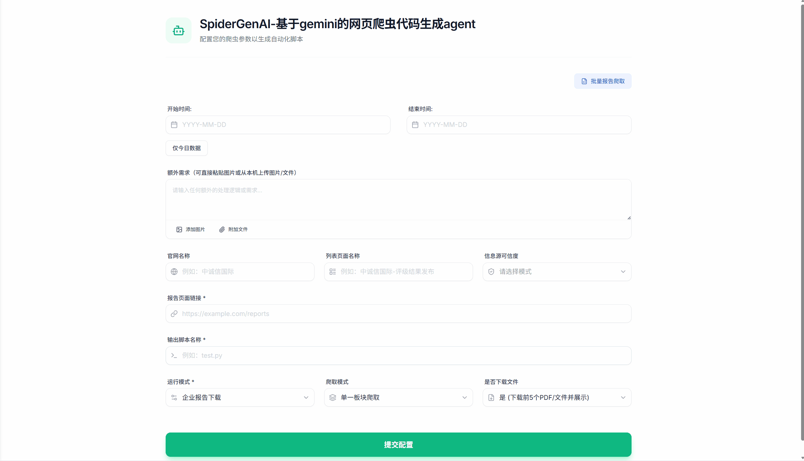
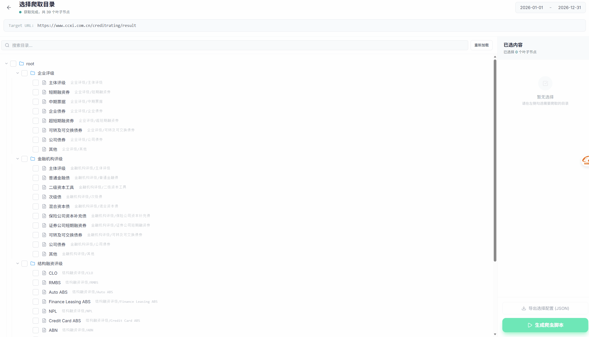

# SpiderGenAI  基于gemini的自动识别网站结构生成爬虫脚本agent

## 目录 (Table of Contents)

- [简介 / Overview](#overview)
- [功能 / Key features](#features)
- [快速开始 / Quickstart](#quickstart)
  - [后端依赖安装 / Backend install](#backend-install)
  - [配置 config.yaml / Configure config.yaml](#configure-config)
  - [启动/部署 Chrome + CDP / Chrome + CDP](#chrome-cdp)
  - [启动后端 / Run backend](#run-backend)
  - [启动前端 / Run frontend](#run-frontend)
- [前端界面使用说明 / UI Guide](#ui-guide)
- [输出位置 / Outputs](#outputs)
- [项目架构与流程 / Architecture & Flow](#architecture-flow)
- [方法与技术亮点 / Highlights](#highlights)
- [目录结构与核心文件说明 / Structure & Key files](#structure-files)
- [安全与 GitHub 提交建议 / Security checklist](#security)
- [常见问题 / Troubleshooting](#troubleshooting)

---

<a id="overview"></a>
## 简介 (Overview)

这是一个**“智能生成爬虫脚本 + 执行 + 前端可视化”**的完整工程：

- **后端**：`pygen/api.py`（FastAPI）负责启动任务、驱动浏览器抓包/分析、调用 LLM 生成脚本、运行脚本并汇总结果  
- **前端**：`frontend/`（Vite + React + TS）负责表单配置、展示日志与结果
- **浏览器自动化**：通过 **Chrome DevTools Protocol (CDP)** 连接到 Chrome，并用 Playwright 做页面交互与网络请求捕获

This repo provides an end-to-end workflow:

- **Backend**: `pygen/api.py` (FastAPI) orchestrates tasks (CDP browser, LLM codegen, script execution, results)
- **Frontend**: `frontend/` (Vite + React + TS) provides UI for configuration/logs/results
- **Browser automation**: Playwright connects to Chrome via **CDP** to interact & capture network requests

---

<a id="features"></a>
## 功能 (Key features)

- **脚本生成**：基于页面结构/网络请求/额外需求，由 LLM 生成可独立运行的 Python 爬虫脚本  
- **多板块爬取**：支持手动选择目录树（多板块）与自动探测板块  
- **结果可视化**：前端实时查看日志、下载脚本、查看报告/新闻列表（支持来源板块标记）  
- **可复用登录态**：使用 `cdp.user_data_dir` 保存 Chrome Profile，支持需要登录的网站（手动登录一次即可复用）

Generates runnable Python crawlers, supports multi-category crawling, visualizes execution logs/results, and can reuse Chrome login state via a persistent profile directory.

---

<a id="quickstart"></a>
## 快速开始 (Quickstart)

### 环境要求 (Prerequisites)

- **Windows 10/11**（其他系统理论可用，但本文以 Windows 为主）  
- **Python**：建议 3.10+  
- **Node.js**：建议 18+ / 20+  
- **Google Chrome**：已安装（后端会自动寻找 `chrome.exe` 并启动 CDP）

---

<a id="backend-install"></a>
### 1) 后端依赖安装 (Backend install)

在项目根目录执行：

```bash
python -m venv .venv
.\.venv\Scripts\activate
pip install -r pygen\requirements.txt
python -m playwright install chromium
```

> 说明：即便使用 CDP 连接本机 Chrome，也需要安装 Playwright 运行时依赖。

---

<a id="configure-config"></a>
### 2) 配置 `config.yaml` (Configure `config.yaml`)

本项目会优先读取：

1. `pygen/config.yaml`（若存在）
2. 项目根目录 `config.yaml`

建议做法：

- 复制模板：`config_copy.yaml` → `config.yaml`
- 填入你的 **LLM API Key** 与 **CDP 配置**

关键配置示例（节选）：

```yaml
llm:
  active: gemini
  gemini:
    api_key: "YOUR_API_KEY"
    model: "gemini-3-pro-preview"
    base_url: "https://generativelanguage.googleapis.com/v1beta/"

cdp:
  debug_port: 9222
  auto_select_port: true
  user_data_dir: "D:/llm_mcp_genpy_runtime/chrome-profile"
  timeout: 60
```

Tip: **不要把真实的 `config.yaml` 提交到 GitHub**（包含密钥）。建议只提交模板文件（如 `config_copy.yaml` 或你自己的 `config.yaml.example`）。

---

<a id="chrome-cdp"></a>
### 3) 启动/部署 Chrome + CDP (Chrome + CDP)

本项目默认会在后端启动任务时**自动启动 Chrome（CDP 模式）**，你通常不需要手工启动。

#### 方式 A：自动启动（推荐）

直接启动后端即可（见下一节）。后端会：

- 查找 Chrome 可执行文件
- 以 `--remote-debugging-port` 启动 Chrome
- 使用 `cdp.user_data_dir` 作为持久化 Profile

#### 方式 B：手动启动（适合排障/复用你的 Chrome）

如果你想手工启动 Chrome 并让后端复用它（端口默认 `9222`），可以在 PowerShell 里执行：

```powershell
"C:\Program Files\Google\Chrome\Application\chrome.exe" `
  --remote-debugging-port=9222 `
  --user-data-dir="D:\llm_mcp_genpy_runtime\chrome-profile" `
  --no-first-run --no-default-browser-check
```

然后启动后端即可复用该实例。

#### 登录态说明 (Login persistence)

如果目标网站需要登录：

- 先用上述 Profile 启动 Chrome
- 在 Chrome 中手动登录一次
- 后续任务会复用该 Profile 的 Cookies/LocalStorage

---

<a id="run-backend"></a>
### 4) 启动后端 (Run backend)

在项目根目录执行：

```bash
python pygen\api.py
```

- API 文档：`http://localhost:8000/docs`
- 前端默认请求后端：`http://localhost:8000`（见 `frontend/types.ts`）

---

<a id="run-frontend"></a>
### 5) 启动前端 (Run frontend)

新开一个终端：

```bash
cd frontend
npm install
npm run dev
```

然后访问 Vite 提示的本地地址（通常为 `http://localhost:5173`）。

---

<a id="ui-guide"></a>
## 前端界面使用说明 (UI Guide)

### 基本流程 (Basic flow)

1. 选择**运行模式**（企业报告下载 / 新闻报告下载 / 新闻舆情爬取）
2. 选择**爬取模式**
   - **单一板块爬取**：直接执行
   - **多板块爬取（手动）**：先进入目录树页选择板块，再执行
   - **自动探测板块并爬取**：由系统自动探测交互入口并抓取
3. 填写 URL、日期范围、是否下载文件等
4. 在执行页查看日志与结果，必要时下载生成脚本

### 额外需求与附件 (Extra requirements & attachments)

- “额外需求”支持输入文字，并可附加图片/文件  
- **当启用“自动探测板块并爬取”时，必须提供额外需求（文字或附件）**，用于说明爬取区域（例如带框选区域截图）

### 结果展示 (Results)

- 企业/新闻报告：展示报告列表；多板块模式下会额外显示“来源板块”
- 新闻舆情：展示文章列表与详情；多板块模式下同样显示“来源板块”

### 界面截图 (UI screenshots)

> 提示：以下为 `pic/` 目录内的 GIF 演示图，便于快速了解前端交互流程。  
> Tip: The following GIFs are stored under `pic/` for a quick UI walkthrough.

#### 1) 首页 (Homepage)



- **说明**：填写 URL、日期范围、运行模式/爬取模式等基础配置。  
- **Note**: Fill in URL, date range, run mode / crawl mode, etc.

#### 2) 自动识别网页目录树并选择 (Tree selection)



- **说明**：多板块爬取（手动）时，用户可以选择手动选取需要爬取的板块（或用自动探测模式给出截图后大模型自己判断需要爬取的板块）。  
- **Note**: Select category paths when using manual multi-category crawling.

#### 3) 企业报告下载 - 执行监控 (Enterprise report - execution)


- **说明**：查看任务日志、进度与报告结果列表；可下载生成脚本/查看文件。  
- **Note**: Monitor logs/progress and inspect report results; download the generated script/files.

#### 4) 新闻舆情爬取 - 执行监控 (News sentiment - execution)


- **说明**：查看任务日志、进度与文章列表/详情；多板块时可标记来源板块。  
- **Note**: Monitor logs/progress and inspect article list/details; categories are labeled in multi-category mode.

---

<a id="outputs"></a>
## 输出位置 (Outputs)

> 运行时会产生大量输出文件，建议不要提交到 GitHub。

- **生成的脚本**：`pygen/py/`
- **执行结果 JSON**：`pygen/output/`
- **Chrome Profile（可复用登录态）**：默认 `pygen/chrome-profile/` 或你在 `cdp.user_data_dir` 配置的目录

---

<a id="architecture-flow"></a>
## 项目架构与流程 (Architecture & Flow)

### 端到端流程 (End-to-end)

```text
Frontend (React)
  ├─ POST /api/menu-tree      (多板块手动：获取目录树)
  └─ POST /api/generate       (启动任务)
          │
          ▼
Backend (FastAPI: pygen/api.py)
  ├─ ChromeLauncher           启动/复用 Chrome CDP
  ├─ BrowserController        Playwright 连接 CDP，抓包/解析/交互探测
  ├─ LLMAgent                 调用 LLM 生成爬虫脚本
  ├─ Post-processor           注入日期/分类映射/输出兜底等增强
  └─ Subprocess run           执行生成脚本 → 汇总 JSON/PDF/新闻等结果
          │
          ▼
GET /api/status/{taskId}      前端轮询状态，展示日志与结果
```

---

<a id="highlights"></a>
## 方法与技术亮点 (Highlights)

- **CDP + Playwright**：用真实浏览器网络栈抓包，适配 SPA/API 型站点  
- **目录树 + 分类映射**：多板块爬取时，基于“真实交互触发的请求差异”构建可靠分类参数映射  
- **生成后后处理（韧性层）**：对 LLM 生成脚本做注入与兜底（日期范围、分类遍历、输出合并等），提升稳定性  
- **前后端闭环**：脚本生成/执行/下载/结果展示在同一 UI 内完成

---

<a id="structure-files"></a>
## 目录结构与核心文件说明 (Structure & Key files)

> 说明 / Note  
> - 下面覆盖“本仓库内的主要源码与配置文件”。  
> - 像 `node_modules/`、`__pycache__/`、`pygen/output/`、Chrome Profile 等属于依赖/运行产物，不建议纳入版本控制。  
> - This section focuses on source/config files; runtime artifacts should be ignored.

### 根目录 (Root)

- `README.md`：本说明（this file）
- `config.yaml`：**你的真实配置（不要提交 / do NOT commit）**
- `config_copy.yaml`：配置模板（可提交 / safe to commit as an example）
- `browser_controller.py`：历史/备份文件（当前后端实际使用的是 `pygen/browser_controller.py`）
- `scripts/test_gemini_connection.py`：LLM 连通性测试脚本
- `sample.xlsx`：示例文件（非运行必需）
- `qwen-crawler-config-generator.zip`：打包文件（非运行必需）
- `SpiderGenAI--Gemini-based-AI-that-generates-spider-code-automatically/`：参考资料/文档（含 PDF），不影响本项目运行

### 后端 `pygen/`

- `pygen/api.py`：FastAPI 服务入口（`/api/generate`、`/api/status`、`/api/menu-tree` 等）
- `pygen/main.py`：CLI 入口（不走前端也可直接生成/后处理脚本）
- `pygen/config.py`：读取/校验 `config.yaml`，提供 LLM/CDP/输出目录等配置（Configuration loader/validator）
- `pygen/chrome_launcher.py`：启动/复用带 CDP 的 Chrome 实例（Launch/reuse Chrome with CDP）
- `pygen/browser_controller.py`：Playwright 连接 CDP；页面交互、抓包、目录树分析、自动探测（CDP controller）
- `pygen/browser_controller_recovered.py`：恢复版/备份（通常不需要）
- `pygen/llm_agent.py`：封装 LLM 调用与脚本生成（LLM agent for code generation）
- `pygen/post_processor.py`：生成后后处理（注入日期、分类映射、输出兜底等）
- `pygen/validator.py`：生成代码的基础校验（syntax / heuristics）
- `pygen/signals_collector.py`：采集页面信号（结构、请求等）用于提示词/决策
- `pygen/date_extractor.py`：日期相关辅助逻辑
- `pygen/error_cases.py`：错误样例与规则集合（用于更稳的生成/修复）
- `pygen/failure_classifier.py`：失败分类（用于定位问题与策略调整）
- `pygen/requirements.txt`：后端 Python 依赖
- `pygen/README.md`：后端子模块说明
- `pygen/py/`：生成脚本输出目录（包含 `.gitkeep` 保持目录存在）

### 前端 `frontend/`

- `frontend/App.tsx`：表单页与视图切换（目录树选择/执行页）
- `frontend/index.tsx`：前端入口（mount React app）
- `frontend/index.html`：页面模板
- `frontend/types.ts`：前端类型定义 + `API_BASE_URL`（默认 `http://localhost:8000`）
- `frontend/components/ExecutionView.tsx`：执行页（启动任务、轮询状态、展示日志/结果、下载脚本/PDF）
- `frontend/components/TreeSelectionView.tsx`：多板块手动选择目录树（`/api/menu-tree`）
- `frontend/components/RichInput.tsx`：额外需求输入 + 附件上传 UI
- `frontend/components/SelectInput.tsx` / `DateInput.tsx` / `FormInput.tsx`：通用表单组件
- `frontend/package.json` / `package-lock.json`：前端依赖与脚本
- `frontend/vite.config.ts` / `tsconfig.json`：构建与 TS 配置
- `frontend/metadata.json`：项目元信息（非关键）
- `frontend/.gitignore` / `frontend/README.md`：前端子模块忽略与说明

---

<a id="security"></a>
## 安全与 GitHub 提交建议 (Security checklist)

建议在 `.gitignore` 排除（示例）：

- `config.yaml`（真实密钥）
- `frontend/.env.local`（如果你放了真实 key）
- `pygen/chrome-profile/`（浏览器登录态/隐私数据）
- `pygen/output/`（爬取结果）
- `__pycache__/`、`*.pyc`、`node_modules/`、`*.log`、`.cursor/`

---

<a id="troubleshooting"></a>
## 常见问题 (Troubleshooting)

- **Chrome 找不到/启动失败**：确认已安装 Google Chrome；或使用“手动启动 CDP”方式启动后再运行后端  
- **端口被占用**：`cdp.auto_select_port: true` 可自动换端口；或手动释放 `9222`  
- **前端连不上后端**：确认后端在 `8000` 启动；如要部署到远端，修改 `frontend/types.ts` 里的 `API_BASE_URL`

