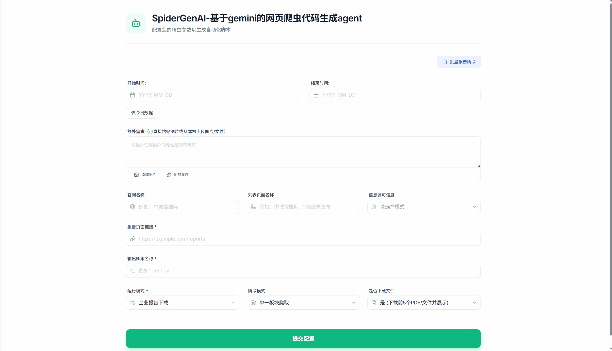
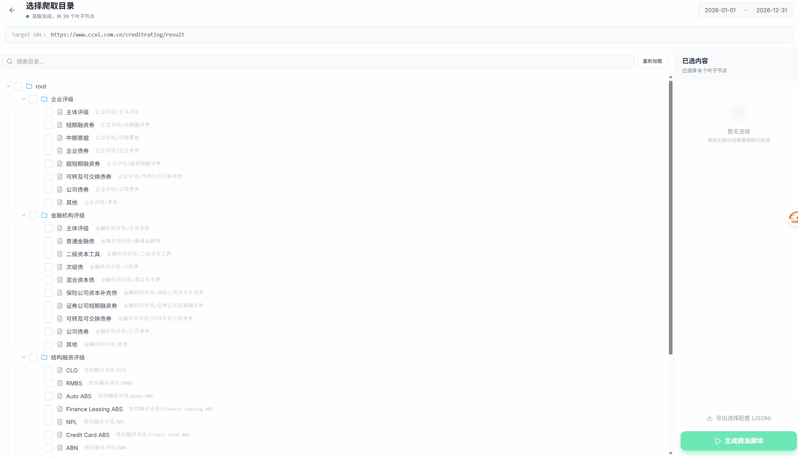
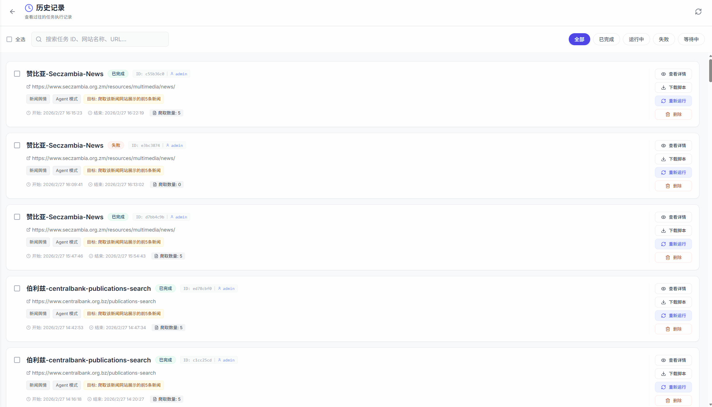

# SpiderGenAI  基于 LLM Agent 的自动网站分析与爬虫脚本生成系统

## 目录 (Table of Contents)

- [简介 / Overview](#overview)
- [功能 / Key features](#features)
- [快速开始 / Quickstart](#quickstart)
  - [后端依赖安装 / Backend install](#backend-install)
  - [Docker 沙箱环境 / Docker Sandbox Setup](#docker-sandbox)
  - [配置 config.yaml / Configure config.yaml](#configure-config)
  - [启动/部署 Chrome + CDP / Chrome + CDP](#chrome-cdp)
  - [启动后端 / Run backend](#run-backend)
  - [启动前端 / Run frontend](#run-frontend)
- [前端界面使用说明 / UI Guide](#ui-guide)
- [输出位置 / Outputs](#outputs)
- [Agent 架构 / Agent Architecture](#agent-architecture)
  - [端到端流程 / End-to-end flow](#e2e-flow)
  - [Planner（ReAct 自主决策循环） / Planner (ReAct Loop)](#planner)
  - [Tool Registry（工具注册与路由） / Tool Registry & Routing](#tool-registry)
  - [工具体系 / Tool Ecosystem](#tool-ecosystem)
  - [Critic（质量评估与自动修复） / Critic (Quality Gate)](#critic)
  - [Executor Session（沙箱执行） / Executor Session (Sandbox)](#executor-session)
  - [Artifact Store（大载荷存储） / Artifact Store](#artifact-store)
- [日期控件检测与 API 提取 / Date Detection & API Extraction](#date-detection)
- [目录结构与核心文件说明 / Structure & Key files](#structure-files)
- [常见问题 / Troubleshooting](#troubleshooting)

---

## 🦹🏻Authors: Liu， Jack Xingchen — Deloitte Shanghai

<a id="overview"></a>
## 简介 (Overview)

这是一个**基于 LLM Agent 自主决策的"智能分析网站 → 生成爬虫脚本 → 执行 → 前端可视化"**完整工程：

- **后端**：`pygen/api.py`（FastAPI）负责启动任务，通过 **Agent Planner** 自主驱动浏览器分析网站、选择策略、调用工具链、生成代码、质量验证，最终执行脚本并汇总结果
- **前端**：`frontend/`（Vite + React + TS）负责表单配置、展示日志与结果
- **浏览器自动化**：通过 **Chrome DevTools Protocol (CDP)** 连接到 Chrome，并用 Playwright 做页面交互与网络请求捕获

This repo provides an end-to-end **agent-driven** workflow:

- **Backend**: `pygen/api.py` (FastAPI) orchestrates tasks via an **Agent Planner** that autonomously explores websites, selects strategies, invokes tools, generates code, validates quality, and executes results
- **Frontend**: `frontend/` (Vite + React + TS) provides UI for configuration/logs/results
- **Browser automation**: Playwright connects to Chrome via **CDP** to interact & capture network requests

---

<a id="features"></a>
## 功能 (Key features)

- **Agent 自主决策**：基于 ReAct 循环的 Planner 自动分析网站结构、选择最佳爬取策略，无需人工干预
- **动态工具生态**：20+ 工具通过 Tool Registry 动态注册与路由，Planner 根据上下文自动选择最合适的工具
- **Critic 质量关卡**：生成代码后经过 3 轮"诊断→修复"循环，确保输出脚本可运行、数据有效
- **沙箱执行**：通过 Executor Session（支持 Docker / 本地）安全运行代码片段与验证
- **多板块爬取**：支持手动选择目录树（多板块）与自动探测板块
- **结果可视化**：前端实时查看日志、下载脚本、查看报告/新闻列表（支持来源板块标记）
- **可复用登录态**：使用 `cdp.user_data_dir` 保存 Chrome Profile，支持需要登录的网站
- **批量任务管理**：支持批量导入任务、队列并发控制与实时状态监控（SSE）

Agent-driven autonomous website analysis and crawler generation, with dynamic tool ecosystem, 3-round critic quality gate, sandbox execution, multi-category crawling, and real-time visualization.

---

<a id="quickstart"></a>
## 快速开始 (Quickstart)

### 环境要求 (Prerequisites)

- **Windows 10/11 / macOS**（本文以 Windows 为主，同时补充 macOS 指令）
- **Python**：建议 3.10+
- **Node.js**：建议 18+ / 20+
- **Google Chrome**：已安装（后端会自动寻找 Chrome 并启动 CDP）
- **Docker Desktop**：Agent 生成的代码会在 Docker 容器中执行验证（Critic 质量关卡），**强烈推荐安装**。未安装时系统回退到本地子进程执行（安全性和隔离性较低）。详见下方 [Docker 沙箱环境](#docker-sandbox) 章节

---

<a id="backend-install"></a>
### 1) 后端依赖安装 (Backend install)

在项目根目录执行：

```bash
python -m venv .venv
.\.venv\Scripts\activate
pip install -r pygen\requirements.txt
python -m playwright install chromium
```

macOS / Linux（bash / zsh）对应指令：

```bash
python3 -m venv .venv
source .venv/bin/activate
python -m pip install -r pygen/requirements.txt
python -m playwright install chromium
```

> 说明：即便使用 CDP 连接本机 Chrome，也需要安装 Playwright 运行时依赖。

---

<a id="docker-sandbox"></a>
### 2) Docker 沙箱环境配置 (Docker Sandbox Setup)

Agent 生成的爬虫代码会在 **Docker 容器**中先行执行验证（Critic 质量关卡 → 沙箱运行 → 检查输出），因此需要本机安装 Docker 环境。若未检测到 Docker，系统会自动回退到本地子进程执行（`local` 模式），隔离性和安全性较低。

#### 2.1) 安装 Docker Desktop

##### Windows

1. 下载 Docker Desktop：<https://www.docker.com/products/docker-desktop/>
2. 双击安装包运行，安装向导中**勾选 "Use WSL 2 instead of Hyper-V"**（推荐）
3. 安装完成后**重启电脑**
4. 启动 Docker Desktop，等待左下角引擎状态变为绿色 **Running**
5. 打开 PowerShell 验证：

```powershell
docker --version
docker info
```

> **Windows 前置要求**
> - 需要 **WSL 2**（Windows Subsystem for Linux 2）。若系统提示未安装，以管理员身份打开 PowerShell 执行：
>   ```powershell
>   wsl --install
>   ```
>   然后重启电脑。
> - BIOS 中须启用虚拟化（Intel VT-x / AMD-V）。大部分笔记本出厂已启用，如遇报错请进 BIOS 手动开启。
> - 如遇 Windows 防火墙提示，请允许 Docker Desktop 通过。

##### macOS

1. 下载 Docker Desktop（根据芯片选择对应版本）：
   - **Apple Silicon (M1/M2/M3/M4)**：<https://desktop.docker.com/mac/main/arm64/Docker.dmg>
   - **Intel**：<https://desktop.docker.com/mac/main/amd64/Docker.dmg>
2. 打开 `.dmg`，将 Docker 拖拽到 Applications 文件夹
3. 启动 Docker Desktop，首次打开时 macOS 会弹出安全性提示 → 前往"系统设置 → 隐私与安全性"允许即可
4. 等待菜单栏 Docker 鲸鱼图标稳定（不再转动），打开终端验证：

```bash
docker --version
docker info
```

---

#### 2.2) 构建沙箱镜像（推荐，预装所有依赖）

项目根目录已包含 `Dockerfile`，可一键构建包含所有 Python 依赖的沙箱镜像。**Windows 与 macOS 命令相同**：

```bash
# 在项目根目录执行（首次构建约需 3-5 分钟，取决于网络速度）
docker build -t pygen-sandbox .
```

该命令会自动完成以下步骤：

1. 拉取基础镜像 `mcr.microsoft.com/playwright/python:v1.41.0-jammy`（含 Python 3 + Playwright + Chromium）
2. 复制 `pygen/requirements.txt` 并执行 `pip install`，**安装所有后端依赖**（requests、httpx、beautifulsoup4、pydantic 等）
3. 安装 Playwright Chromium 浏览器运行时

> 构建完成后，在 `config.yaml` 的 `sandbox` 部分指定你构建的镜像名（见下方配置章节）：
>
> ```yaml
> sandbox:
>   enabled: true
>   backend: docker
>   docker_image: "pygen-sandbox"
>   docker_auto_pull: false
> ```

**如果后续更新了 `pygen/requirements.txt`（添加了新的 Python 库），需要重新执行 `docker build -t pygen-sandbox .` 以更新镜像。**

---

#### 2.3) 使用默认基础镜像（快速上手，不推荐）

如果不想手动构建，系统首次运行时会**自动拉取**微软官方 Playwright 镜像：

```bash
# 也可手动预拉取（可选）
docker pull mcr.microsoft.com/playwright/python:v1.41.0-jammy
```

> **注意**：基础镜像**不包含** `requirements.txt` 中的额外依赖（`requests`、`beautifulsoup4`、`httpx` 等）。Agent 会在运行时通过 `install_python_packages` 工具按需安装，但**每次新建容器都需要重新安装**，首次验证耗时更长。推荐使用 2.2 的构建方式。

---

#### 2.4) Docker Desktop 资源配置建议

打开 Docker Desktop → **Settings → Resources**：

| 资源 | 推荐最低值 | 说明 |
|------|-----------|------|
| **CPU** | ≥ 2 核 | 沙箱执行生成脚本 + 浏览器渲染 |
| **Memory** | ≥ 4 GB | Playwright Chromium 内存占用较高 |
| **Disk** | ≥ 10 GB | 基础镜像约 2-3 GB + 构建缓存 |

> **Windows WSL 2 用户**：资源上限由 WSL 控制。如需调整，编辑 `%USERPROFILE%\.wslconfig`：
>
> ```ini
> [wsl2]
> memory=8GB
> processors=4
> ```
>
> 保存后在 PowerShell 执行 `wsl --shutdown` 使配置生效。

---

#### 2.5) 验证 Docker 沙箱环境

```bash
# 1. 验证 Docker 守护进程正常
docker run --rm hello-world

# 2. 验证沙箱镜像已构建（若使用 2.2 构建方式）
docker run --rm pygen-sandbox python -c "import requests; import bs4; import httpx; print('All dependencies OK')"

# 3. 验证 Playwright 可用
docker run --rm pygen-sandbox python -c "from playwright.sync_api import sync_playwright; print('Playwright OK')"
```

如果以上命令全部输出正常，Docker 沙箱环境即就绪。

---

#### 2.6) 重要注意事项

1. **Docker Desktop 必须保持运行**：后端启动任务时会通过 Docker CLI 创建沙箱容器。如果 Docker Desktop 未启动，系统自动回退到 `local` 模式
2. **首次拉取/构建较慢**：Playwright 基础镜像约 2 GB，请确保网络通畅；后续构建利用缓存会很快
3. **镜像与 requirements.txt 同步**：每次修改 `pygen/requirements.txt` 后，务必重新 `docker build -t pygen-sandbox .`，否则沙箱中会缺少新增的库
4. **磁盘清理**：长时间使用后可运行 `docker system prune -f` 清理悬空镜像和停止的容器
5. **网络代理**：如果你在公司代理环境下，Docker 构建时可能需要配置代理。在 Docker Desktop → Settings → Resources → Proxies 中设置，或在构建时传入：
   ```bash
   docker build --build-arg HTTP_PROXY=http://proxy:port --build-arg HTTPS_PROXY=http://proxy:port -t pygen-sandbox .
   ```
6. **多任务并发**：每个任务会启动独立的沙箱容器（容器名格式 `pygen-exec-<session_id>`），任务结束后自动销毁（`--rm`）

---

<a id="configure-config"></a>
### 3) 配置 `config.yaml` (Configure `config.yaml`)

本项目会优先读取：

1. `pygen/config.yaml`（若存在）
2. 项目根目录 `config.yaml`

建议做法：

- 复制模板：`config_copy.yaml` → `config.yaml`
- 填入你的 **LLM API Key** 与 **CDP 配置**

关键配置示例（节选）：

```yaml
llm:
  active: gemini
  gemini:
    api_key: "YOUR_API_KEY"
    model: "gemini-3-pro-preview"
    base_url: "https://generativelanguage.googleapis.com/v1beta/"

cdp:
  debug_port: 9222
  auto_select_port: true
  user_data_dir: "D:/llm_mcp_genpy_runtime/chrome-profile"
  timeout: 60

# Docker 沙箱配置（如已按上一步构建镜像）
sandbox:
  enabled: true
  backend: auto               # docker / local / auto
  docker_image: "pygen-sandbox"
  docker_auto_pull: false      # 本地构建的镜像无需拉取
  docker_mount_workdir: true
  docker_disable_network: false
```

> macOS 提示：`cdp.user_data_dir` 建议使用类似 `"/Users/<you>/llm_mcp_genpy_runtime/chrome-profile"` 或 `"$HOME/llm_mcp_genpy_runtime/chrome-profile"`（YAML 中可直接写绝对路径字符串）。

> 如果没有构建自定义镜像，可省略 `sandbox` 段或将 `docker_image` 设为默认值 `"mcr.microsoft.com/playwright/python:v1.41.0-jammy"`，并将 `docker_auto_pull` 设为 `true`。

Tip: **不要把真实的 `config.yaml` 提交到 GitHub**（包含密钥）。建议只提交模板文件（如 `config_copy.yaml` 或你自己的 `config.yaml.example`）。

---

<a id="chrome-cdp"></a>
### 4) 启动/部署 Chrome + CDP (Chrome + CDP)

本项目默认会在后端启动任务时**自动启动 Chrome（CDP 模式）**，你通常不需要手工启动。

#### 方式 A：自动启动（推荐）

直接启动后端即可（见下一节）。后端会：

- 查找 Chrome 可执行文件
- 以 `--remote-debugging-port` 启动 Chrome
- 使用 `cdp.user_data_dir` 作为持久化 Profile

#### 方式 B：手动启动（适合排障/复用你的 Chrome）

如果你想手工启动 Chrome 并让后端复用它（端口默认 `9222`），可以在 PowerShell 里执行：

```powershell
"C:\Program Files\Google\Chrome\Application\chrome.exe" `
  --remote-debugging-port=9222 `
  --user-data-dir="D:\llm_mcp_genpy_runtime\chrome-profile" `
  --no-first-run --no-default-browser-check
```

macOS 下可执行（注意应用路径中包含空格）：

```bash
"/Applications/Google Chrome.app/Contents/MacOS/Google Chrome" \
  --remote-debugging-port=9222 \
  --user-data-dir="$HOME/llm_mcp_genpy_runtime/chrome-profile" \
  --no-first-run --no-default-browser-check
```

然后启动后端即可复用该实例。

#### 登录态说明 (Login persistence)

如果目标网站需要登录：

- 先用上述 Profile 启动 Chrome
- 在 Chrome 中手动登录一次
- 后续任务会复用该 Profile 的 Cookies/LocalStorage

---

<a id="run-backend"></a>
### 5) 启动后端 (Run backend)

在项目根目录执行：

```bash
# Windows
python pygen\api.py

# macOS / Linux
python pygen/api.py
```

- API 文档：`http://localhost:8000/docs`
- 前端默认请求后端：`http://localhost:8000`（见 `frontend/types.ts`）

---

<a id="run-frontend"></a>
### 6) 启动前端 (Run frontend)

新开一个终端：

```bash
cd frontend
npm install
npm run dev
```

然后访问 Vite 提示的本地地址（通常为 `http://localhost:5173`）。

---

<a id="ui-guide"></a>
## 前端界面使用说明 (UI Guide)

### 基本流程 (Basic flow)

> **批量爬取 (Batch Mode)**：点击首页右上角"批量报告爬取"按钮，可进入批量任务配置与监控界面。

1. 选择**运行模式**（企业报告下载 / 新闻报告下载 / 新闻舆情爬取）
2. 填写 URL、日期范围、是否下载文件等
3. 点击执行后，Agent Planner 将自主完成网站分析 → 策略选择 → 代码生成 → 质量验证 → 执行
4. 在执行页查看日志与结果，必要时下载生成脚本

### 额外需求与附件 (Extra requirements & attachments)

- "额外需求"支持输入文字，并可附加图片/文件
- 额外需求会作为 Agent 的最高优先级指令，指导其探测方向

### 结果展示 (Results)

- 企业/新闻报告：展示报告列表；多板块模式下会额外显示"来源板块"
- 新闻舆情：展示文章列表与详情；多板块模式下同样显示"来源板块"

### 界面演示 (UI presentation)

> 提示：以下为 `pic/` 目录内的 GIF 演示图，便于快速了解前端交互流程。
> Tip: The following GIFs are stored under `pic/` for a quick UI walkthrough.

#### 1) 首页 (Homepage)



- **说明**：填写 URL、日期范围、运行模式等基础配置。
- **Note**: Fill in URL, date range, run mode, etc.

#### 2) 自动识别网页目录树并选择 (Tree selection)



- **说明**：多板块爬取（手动）时，用户可以选择手动选取需要爬取的板块。
- **Note**: Select category paths when using manual multi-category crawling.

#### 3) 企业报告下载 - 执行监控 (Enterprise report - execution)


- **说明**：查看任务日志、进度与报告结果列表；可下载生成脚本/查看文件。
- **Note**: Monitor logs/progress and inspect report results; download the generated script/files.

#### 4) 新闻舆情爬取 - 执行监控 (News sentiment - execution)


- **说明**：查看任务日志、进度与文章列表/详情；多板块时可标记来源板块。
- **Note**: Monitor logs/progress and inspect article list/details; categories are labeled in multi-category mode.

#### 5) 批量爬取界面 (Batch Crawling Interface)


- **说明**：支持手动配置批量任务，实时监控队列状态、查看任务日志与结果（成功/失败/重试）。
- **Note**: Configure batch tasks, monitor queue status, logs, and results (success/failure/retry).

#### 6) 历史记录界面 (Batch Crawling Interface)



- **说明**：历史记录界面可以支持查看跑过的历史记录日志，并且提供导出每个任务的配置信息（csv格式）和下载脚本以及任务的重新运行操作，并且都支持批量处理。也支持对不想要的历史记录的删除以及批量删除操作。
- **Note**: The history interface allows users to view past task logs and provides options to export configuration information for each task (CSV format), download scripts, and rerun tasks, all with batch processing support. It also supports deleting unwanted history entries and performing batch deletion.
---

<a id="outputs"></a>
## 输出位置 (Outputs)

> 运行时会产生大量输出文件，建议不要提交到 GitHub。

- **生成的脚本**：`pygen/py/`
- **执行结果 JSON**：`pygen/output/`
- **Artifact 存储**：`pygen/output/artifacts/`（大载荷工具输出、截图等）
- **Chrome Profile（可复用登录态）**：默认 `pygen/chrome-profile/` 或你在 `cdp.user_data_dir` 配置的目录

---

<a id="agent-architecture"></a>
## Agent 架构 (Agent Architecture)

系统核心是一个 **ReAct 风格的自主 Agent**，由以下组件协同工作：

The core is a **ReAct-style autonomous agent** composed of the following components:

```text
┌─────────────────────────────────────────────────────────────────┐
│                    Frontend (React + TS)                         │
│  POST /api/generate → SSE /api/status/{taskId} (实时日志)        │
└──────────────────────────┬──────────────────────────────────────┘
                           │
                           ▼
┌─────────────────────────────────────────────────────────────────┐
│                  Backend (FastAPI: api.py)                       │
│  ChromeLauncher → BrowserController → AgentPlanner.run()        │
└──────────────────────────┬──────────────────────────────────────┘
                           │
          ┌────────────────┼────────────────┐
          ▼                ▼                ▼
   ┌─────────────┐ ┌─────────────┐ ┌──────────────┐
   │   Planner   │ │Tool Registry│ │   Critic     │
   │ (ReAct Loop)│◀│ (Router)    │ │(Quality Gate)│
   │  LLM ←→ Act │ │ 20+ tools   │ │ 3-round loop │
   └──────┬──────┘ └──────┬──────┘ └──────┬───────┘
          │               │               │
          ▼               ▼               ▼
   ┌─────────────┐ ┌─────────────┐ ┌──────────────┐
   │  ToolContext │ │  Artifact   │ │  Executor    │
   │(Shared State)│ │   Store     │ │  Session     │
   │ browser/llm │ │(Large Data) │ │ (Sandbox)    │
   └─────────────┘ └─────────────┘ └──────────────┘
```

---

<a id="e2e-flow"></a>
### 端到端流程 (End-to-end flow)

```text
1. 用户在前端提交任务 (URL, 日期, 运行模式, 额外需求)
        │
2. API 层启动 Chrome CDP + BrowserController
        │
3. AgentPlanner.run() 进入 ReAct 循环 (最多 20 轮迭代)
        │
        ├─ Thought: LLM 分析当前状态，决定下一步行动
        ├─ Action:  通过 ToolRegistry 路由到具体工具执行
        ├─ Observation: 工具返回 ToolResult，反馈给 LLM
        └─ 重复直到 LLM 调用 finish 或达到迭代上限
        │
4. Critic 质量关卡: 验证生成代码 → 可选自动修复
        │
5. Post-processor: 注入日期/分类映射/输出兜底等增强
        │
6. Subprocess: 执行生成脚本 → 汇总 JSON/PDF/新闻等结果
        │
7. 前端通过 SSE 实时展示日志与最终结果
```

---

<a id="planner"></a>
### Planner — ReAct 自主决策循环 (ReAct Loop)

**文件**：`pygen/planner.py` — `AgentPlanner` 类

Planner 是系统的"大脑"，采用 ReAct（Reasoning + Acting）范式驱动任务。每一轮迭代：

1. **构建 System Prompt**：动态注入当前可用工具列表（通过 ToolRegistry）
2. **LLM 推理**：模型输出 `{"thought": "...", "action": "tool_name", "action_input": {...}}`
3. **工具执行**：通过 ToolRegistry 路由到对应工具
4. **观察反馈**：将 ToolResult 格式化为结构化 observation 返回给 LLM
5. **失败重规划**：连续失败或重复失败时触发 `[REPLAN_REQUIRED]`，引导 LLM 切换策略

| 特性 | 说明 |
|------|------|
| 多模型支持 | OpenAI-compatible / Gemini / Claude 三种 provider |
| 动态工具发现 | 每轮迭代重新解析可用工具（基于 run_mode、上下文条件） |
| Critic 关卡 | `finish` 前自动触发 Critic 评估，不通过则要求继续改进 |
| 大载荷处理 | 工具输出超过 3000 字符时自动存入 ArtifactStore，仅传引用给 LLM |
| 取消支持 | 通过 `cancel_check` 回调实现任务中途取消 |

**标准工作流**（aim for 6 iterations）：

```text
open_page → extract_list_and_pagination → probe_detail_page
          → generate_crawler_code → validate_code → finish
```

---

<a id="tool-registry"></a>
### Tool Registry — 工具注册与路由 (Tool Registry & Routing)

**文件**：`pygen/tool_registry.py` — `ToolRegistry` 类

Tool Registry 是工具生态的中枢，负责：

- **注册**：每个工具以 `ToolSpec`（名称、描述、参数 schema）+ handler 函数注册
- **动态过滤**：根据 `run_mode`、`availability_check`、`enabled` 状态决定当前可用工具
- **路由执行**：`execute_tool(ctx, name, input)` 分发到对应 handler，统一错误处理
- **回退建议**：每个工具配有 `fallback_map`，失败时推荐替代工具
- **Prompt 生成**：`get_tools_prompt()` 为 Planner 的 System Prompt 动态生成工具描述

```python
@dataclass
class RegisteredTool:
    spec: ToolSpec          # 名称 + 描述 + 参数 schema
    handler: ToolHandler    # async (ctx, **kwargs) -> ToolResult
    enabled: bool           # 是否启用
    tags: Set[str]          # 标签分类 (atomic/high_level/sandbox/...)
    run_modes: Set[str]     # 限定运行模式 (enterprise_report/news_sentiment/...)
    risk_level: str         # low / medium / high
    availability_check      # 动态可用性检查 (如需要 executor_session 才可用)
```

---

<a id="tool-ecosystem"></a>
### 工具体系 (Tool Ecosystem)

工具分为 4 层，20+ 个工具供 Planner 调用：

#### 原子工具 (Atomic Tools) — `pygen/tools.py`

底层浏览器/网络操作，单一职责：

| 工具 | 说明 |
|------|------|
| `open_page` | 打开目标 URL |
| `scroll_page` | 触发懒加载 |
| `get_page_info` | 获取页面标题/URL |
| `get_page_html` | 捕获完整 HTML |
| `take_screenshot` | 页面截图 (base64) |
| `get_network_requests` | 获取捕获的 API/XHR 请求 |
| `wait_for_network_idle` | 等待网络空闲 |
| `detect_data_status` | 检测数据/空/加载/错误状态 |
| `analyze_page` | 综合分析页面结构 |

#### 高级工具 (High-Level Tools) — `pygen/high_level_tools.py`

封装多步 CDP/Playwright 工作流：

| 工具 | 说明 |
|------|------|
| `extract_list_and_pagination` | 自动发现列表项 + CSS 选择器 + 分页控件 + 日期范围 |
| `capture_api_and_infer_params` | 动态 API 嗅探 + 参数归因（page/date/category） |
| `turn_page_and_verify_change` | 翻页并验证内容确实变化 |
| `probe_detail_page` | 在新标签页探测详情页正文容器 |

#### 导航与策略工具 (Navigation & Strategy Tools)

| 工具 | 说明 |
|------|------|
| `get_site_menu_tree` | 提取站点菜单树 |
| `probe_navigation` | 点击菜单路径，捕获 API/筛选映射 |
| `build_verified_category_mapping` | 构建验证后的分类参数映射 |
| `smart_date_api_scan` | 四层渐进式日期 API 检测 |
| `enhanced_page_analysis` | 浏览器原生增强分析 |

#### 生成与质量工具 (Generation & Quality Tools)

| 工具 | 说明 |
|------|------|
| `generate_crawler_code` | 基于收集的上下文调用 LLM 生成爬虫脚本 |
| `validate_code` | 静态代码校验 |
| `critic_validate` | 规则 + LLM 辅助验收验证 |
| `run_python_snippet` | 在沙箱中运行 Python 代码片段 |
| `install_python_packages` | 在沙箱中安装 Python 包 (策略控制) |

#### 统一工具结果 (Unified ToolResult)

所有工具返回标准化的 `ToolResult`：

```python
@dataclass
class ToolResult:
    success: bool
    data: Any                          # 工具输出数据
    error: Optional[str]               # 错误信息
    summary: str                       # 简洁摘要（给 LLM 看）
    error_code: Optional[str]          # 结构化错误码
    retryable: bool                    # 是否可重试
    recoverable: bool                  # 是否可恢复
    suggested_next_tools: List[str]    # 推荐下一步工具
    artifacts: Dict[str, Any]          # 大载荷引用
    confidence: Optional[float]        # 置信度
```

---

<a id="critic"></a>
### Critic — 质量评估与自动修复 (Quality Gate)

**文件**：`pygen/critic_runtime.py` — `Critic` 类

Critic 是 Agent 的"质量保障层"，在 Planner 调用 `finish` 前自动触发：

1. **静态校验**：调用 `StaticCodeValidator` 检查语法和常见反模式
2. **轻量级运行时验证**：在 Executor Session 中实际执行生成代码，检查输出
3. **失败分类**：`FailureClassifier` 自动归因（选择器不匹配 / 分页丢失 / 日期提取失败 / WAF 拦截 ...）
4. **LLM 辅助修复**：将诊断结果传给 LLM，请求针对性修复
5. **3 轮循环**：最多 3 轮"诊断 → 修复 → 重新验证"，直到通过或用尽轮次

```text
Code → Static Check → Runtime Execute → Classify Failure
  ↑                                           │
  └── LLM Repair ← Diagnosis Report ←────────┘
          (最多 3 轮 / up to 3 rounds)
```

---

<a id="executor-session"></a>
### Executor Session — 沙箱执行 (Sandbox)

**文件**：`pygen/executor_session.py` — `ExecutorSession` 类

提供代码解释器式的执行环境，支持两种后端：

| 后端 | 说明 |
|------|------|
| **docker** | 在隔离容器中运行，支持持久化会话、网络控制、工作目录挂载 |
| **local** | 本地子进程后端（fallback） |

- **持久化命名空间**：同一 session 内多次 `run_python` 共享变量状态
- **包安装**：通过 `install_python_packages` 在沙箱内安装依赖（策略白名单控制）
- **超时控制**：每次执行可设独立超时

---

<a id="artifact-store"></a>
### Artifact Store — 大载荷存储 (Large Payload Storage)

**文件**：`pygen/artifact_store.py` — `ArtifactStore` 类

当工具输出（HTML、网络请求、截图等）超过阈值时，自动存入文件系统，仅将 `ArtifactRef`（ID + 路径 + 预览）传递给 LLM，避免 context window 溢出。

---

<a id="date-detection"></a>
## 日期控件检测与 API 提取 (Date Detection & API Extraction)

当使用 `smart_date_api_scan` 工具时，系统采用**四层渐进式架构**自动检测页面的日期筛选接口，核心实现在 `pygen/date_api_extractor.py`。

### 四层架构 (Four-layer Architecture)

```text
用户输入 URL + 日期范围
        │
        ▼
┌─ Layer 0: JS 全局变量扫描 ──────────────────────────┐
│  技术: Playwright page.evaluate() 扫描 window 对象    │
│  原理: 直接读取前端配置变量 (如 LatestAnnouncement)    │
│  提取: API URL + 日期参数名 + 请求参数                 │
│  成功 → 跳过所有后续层，直接生成确定性脚本              │
└──────────── 失败 ▼ ─────────────────────────────────┘
┌─ Layer 1: 纯 API 直连 ─────────────────────────────┐
│  技术: CDP Network 事件监听                          │
│  原理: 分析页面加载时的网络请求，识别含日期参数的 API   │
└──────────── 失败 ▼ ─────────────────────────────────┘
┌─ Layer 2: DOM 特征检测 + 自动操作 ──────────────────┐
│  技术: Playwright DOM 查询 + CDP Input.insertText    │
│  支持: Laydate / ElementUI / AntDesign / Bootstrap   │
│        / native input / 通用 input[placeholder]      │
│  步骤: 检测控件类型 → 三级填写策略 → 点击提交 → 捕获 API│
└──────────── 失败 ▼ ─────────────────────────────────┘
┌─ Layer 3: 截图 + LLM 视觉分析 ─────────────────────┐
│  技术: Playwright screenshot + Gemini/Qwen 多模态    │
│  兜底: 处理无法程序化识别的非标日期控件                │
└──────────── 失败 → 回退到通用 LLM 生成爬虫 ──────────┘
        │ 任一层成功
        ▼
┌─ 验证 + 脚本生成 ──────────────────────────────────┐
│  1. httpx 重放 API 验证数据 (自动截断未来日期)        │
│  2. analyze_response_schema() 自动推断字段映射        │
│  3. LLM "完形填空" 补全未识别字段 (可选)              │
│  4. 确定性模板生成 Python 爬虫脚本 (不调 LLM)         │
└────────────────────────────────────────────────────┘
```

越靠前的层**越精准、越快、越不依赖 LLM**。例如上交所 (SSE) 在 Layer 0 即可直接命中，全程不需要调用大模型。

### 日期控件自动操作 — 三级填写策略 (Input Fill Strategy)

Layer 2 的 `_safe_fill()` 采用三级递进策略，兼容各类日期控件：

| 优先级 | 策略 | 技术 | 适用场景 |
|--------|------|------|---------|
| 1 | Playwright `fill()` | Playwright API | 非 readonly 的普通 input |
| 2 | CDP `Input.insertText` | Chrome DevTools Protocol | readonly 的 Laydate / ElementUI 等 (引擎级键盘输入，触发完整原生事件链) |
| 3 | JS `nativeSetter.call()` | JavaScript evaluate | CDP 不可用时的兜底 |

### 字段映射自适应 (Adaptive Field Mapping)

`pygen/deterministic_templates.py` 中的 `analyze_response_schema()` 从 API 响应中自动推断字段映射（日期、标题、下载链接、证券代码等），三层递进：

1. **自动检测**：正则匹配字段名 + 值格式识别（如 `SSEDATE` 匹配日期模式、`attachPath` 匹配 URL 模式）
2. **LLM 完形填空**：对未识别的字段类别，构造 cloze prompt 让 LLM 补全
3. **通用兜底列表**：`["publishDate", "date", "Date", ...]` 等常见字段名

---

<a id="structure-files"></a>
## 目录结构与核心文件说明 (Structure & Key files)

### 根目录 (Root)

- `README.md`：本说明（this file）
- `config.yaml`：**你的真实配置（配置模板）**

### 后端 `pygen/` — Agent 核心

| 文件 | 角色 | 说明 |
|------|------|------|
| `api.py` | API 入口 | FastAPI 服务，启动任务 → 调用 AgentPlanner → 执行脚本 → 返回结果 |
| `planner.py` | **Planner** | ReAct 自主决策循环，LLM 多轮对话驱动工具调用 |
| `tool_registry.py` | **Tool Registry** | 动态工具注册、路由、过滤、回退建议 |
| `tools.py` | **工具实现** | ToolContext / ToolResult 定义 + 原子工具 + 沙箱/Critic 工具 |
| `high_level_tools.py` | **高级工具** | 封装多步工作流（列表提取、API 嗅探、翻页验证、详情页探测） |
| `critic_runtime.py` | **Critic** | 3 轮诊断-修复循环，含静态校验 + 运行时验证 + LLM 修复 |
| `critic.py` | Critic 基础版 | 基础规则验证 |
| `executor_session.py` | **Executor** | Docker/本地沙箱执行环境 |
| `artifact_store.py` | **Artifact Store** | 大载荷文件存储，保持 LLM context 精简 |
| `config.py` | 配置 | 读取/校验 config.yaml |
| `chrome_launcher.py` | Chrome | 启动/复用带 CDP 的 Chrome 实例 |
| `browser_controller.py` | Browser | Playwright 连接 CDP；页面交互、抓包、目录树分析 |
| `llm_agent.py` | LLM Agent | 封装 LLM 调用与代码生成 prompt |
| `post_processor.py` | 后处理 | 注入日期、分类映射、输出兜底等增强 |
| `validator.py` | 校验器 | 生成代码的静态校验 (语法 / 反模式) |
| `failure_classifier.py` | 失败分类 | 自动归因运行时失败原因 |
| `signals_collector.py` | 信号采集 | 采集执行信号（状态、输出、异常）供 Critic 使用 |
| `date_api_extractor.py` | 日期 API | 四层渐进式日期 API 检测 |
| `deterministic_templates.py` | 模板引擎 | 确定性脚本生成（字段映射 + 模板渲染） |
| `queue_manager.py` | 队列管理 | 批量任务并发控制与调度 |
| `realtime.py` | SSE 推送 | 日志与状态实时前端同步 |
| `error_cases.py` | 错误样例 | 错误规则集合（用于更稳的生成/修复） |
| `py/` | 输出目录 | 生成的爬虫脚本 |

### 前端 `frontend/`

- `frontend/App.tsx`：表单页与视图切换（目录树选择/执行页）
- `frontend/index.tsx`：前端入口（mount React app）
- `frontend/index.html`：页面模板
- `frontend/types.ts`：前端类型定义 + `API_BASE_URL`（默认 `http://localhost:8000`）
- `frontend/components/ExecutionView.tsx`：执行页（启动任务、轮询状态、展示日志/结果、下载脚本/PDF）
- `frontend/components/TreeSelectionView.tsx`：多板块手动选择目录树（`/api/menu-tree`）
- `frontend/components/BatchConfigView.tsx`：**批量任务配置页**
- `frontend/components/BatchExecutionView.tsx`：**批量任务执行监控页**
- `frontend/components/RichInput.tsx`：额外需求输入 + 附件上传 UI
- `frontend/components/SelectInput.tsx` / `DateInput.tsx` / `FormInput.tsx`：通用表单组件
- `frontend/package.json` / `package-lock.json`：前端依赖与脚本
- `frontend/vite.config.ts` / `tsconfig.json`：构建与 TS 配置

---

<a id="troubleshooting"></a>
## 常见问题 (Troubleshooting)

- **Chrome 找不到/启动失败**：确认已安装 Google Chrome；或使用"手动启动 CDP"方式启动后再运行后端
- **端口被占用**：`cdp.auto_select_port: true` 可自动换端口；或手动释放 `9222`
- **前端连不上后端**：确认后端在 `8000` 启动；如要部署到远端，修改 `frontend/types.ts` 里的 `API_BASE_URL`
- **Agent 迭代上限**：默认 20 轮迭代；如目标网站复杂可在 API 调用时调整 `max_iterations`
- **Critic 多次不通过**：检查目标网站是否有反爬策略（WAF/验证码），可查看 `[CRITIC]` 日志了解失败原因
